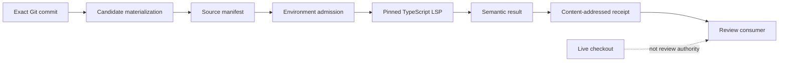

# Review-LSP

[](https://github.com/maemreyo/review-lsp/actions/workflows/ci.yml)
[](https://www.npmjs.com/package/review-lsp)
[](https://www.npmjs.com/package/review-lsp)
[](LICENSE)
[](https://github.com/maemreyo/review-lsp/releases)

**Candidate-bound semantic code intelligence with provenance for AI code review.**

Review-LSP runs LSP semantic queries against an exact Git candidate, not whichever checkout happens to be live. Each successful query returns a content-addressed receipt binding the candidate, document, semantic toolchain, environment, request, result, and isolation mode.

Current public release: **0.1.0-alpha.6**.

```bash
npm install review-lsp@alpha
npx review-lsp artifact-info
```

> Use the explicit `@alpha` dist-tag while Review-LSP is prerelease software.

## Why Review-LSP?

Editor LSPs answer questions about the workspace that is open **now**. Code review frequently needs a different authority: the exact commit being reviewed.

Review-LSP makes that distinction explicit.

```text
commit A: value is string
commit B: value becomes number
live checkout: B

query(candidate = A)  -> string
query(live workspace) -> irrelevant to the review
```

The included A/B acceptance test exercises exactly this case.

## What it proves — and what it does not

| Claim | Meaning |
| --- | --- |
| `source_binding=VERIFIED` | The retained source matches the admitted candidate manifest at the required integrity checks. |
| `environment_binding=VERIFIED` | The semantic inputs covered by the active profile are fully admitted. |
| `environment_binding=PARTIAL` | Some semantic input, such as package dependencies or external config, is not yet snapshot-bound. |
| `TRUSTED_LOCAL` | Native candidate bytes are read-only and integrity-checked, but the host itself is trusted. |
| `CONTAINER_READ_ONLY` | Linux verified the candidate as a read-only mount and the exact container image identity is bound. |

Receipts are **tamper-evident evidence**, not signatures and not proof that the language server—or the reviewed code—is semantically correct.

## Architecture



The standalone core does not depend on Zamery Workbench or OpenCodeReview. Consumer adapters can admit Review-LSP receipts independently.

For the component-level model and trust boundaries, see [docs/ARCHITECTURE.md](docs/ARCHITECTURE.md).

## Alpha surface

The current TypeScript profile includes:

- `typescript-language-server@6.0.0`;
- `typescript@6.0.3`;
- exact local Git commit candidates;
- candidate-contained TypeScript project-reference graphs admitted as a strict subset and bound into environment evidence;
- exact candidate-bound TypeScript project ownership/routing for the admitted `files` / `include` / `exclude` / relative-`extends` subset, including the minimal `allowJs` membership modifier;
- `hover`, `definition`, `references`, and document `diagnostics`;
- CLI lifecycle: `prepare`, `inspect`, point `query`, document `diagnostics`, `validate`, `close`;
- MCP stdio server with:
  - `review_lsp_candidate_info`
  - `review_lsp_hover`
  - `review_lsp_definition`
  - `review_lsp_references`
  - `review_lsp_diagnostics`;
- native `TRUSTED_LOCAL` execution;
- Linux `CONTAINER_READ_ONLY` execution;
- content-addressed package/provider artifact identity;
- offline pnpm dependency snapshots and sealed semantic projections;
- workspace entry-point completeness plus constrained TypeScript declaration derivation;
- project-aligned candidate TypeScript engines, including TypeScript 7 native LSP, when an enforced isolation profile is available;
- persistent candidate/project semantic runtime reuse with exact-keyed provenance.

## Quickstart

Prepare an exact commit:

```bash
npx review-lsp prepare /path/to/repo <commit> --state /tmp/review-lsp-state
```

The output includes `candidate_descriptor`. Query it using 0-based LSP positions:

```bash
npx review-lsp query <candidate.json> hover src/example.ts 12 8
npx review-lsp query <candidate.json> definition src/example.ts 12 8
npx review-lsp query <candidate.json> references src/example.ts 12 8 --include-declaration false
npx review-lsp diagnostics <candidate.json> src/example.ts
```

Validate the persisted receipt:

```bash
npx review-lsp validate <receipt.json>
```

Release the retained candidate when finished:

```bash
npx review-lsp close <candidate.json>
```

Inspect the installed provider identity:

```bash
npx review-lsp artifact-info
```

## MCP

Run an MCP stdio server bound to one candidate at process start:

```bash
npx review-lsp serve /path/to/repo <commit> --state /tmp/review-lsp-state
```

The semantic MCP tools require `expected_candidate_id`, so a caller cannot silently retarget a running process to another candidate. Logs go to stderr; stdout is reserved for MCP framing.

## Linux container profile

From a source checkout on Linux with Docker:

```bash
pnpm container:build
pnpm test:container:linux
```

The container profile uses:

- a read-only candidate bind mount;
- a read-only root filesystem;
- no network;
- dropped Linux capabilities;
- `no-new-privileges`;
- bounded memory, CPU, and PIDs;
- tmpfs only for bounded writable state/scratch;
- exact Docker image identity in the environment manifest.

The inner process verifies that `/candidate` is an explicit Linux read-only mount before a receipt may claim `CONTAINER_READ_ONLY`.

## Release evidence

`0.1.0-alpha.6` is release-gated by:

- exact-candidate project-ownership unit coverage plus TypeScript 6/7 exact-engine ownership/routing acceptance;
- exact release-candidate `pnpm check`, package/MCP/cache-crash smokes and benchmark;
- Workbench provider dogfood proving a nested document routes to its evidence-proven project owner rather than the nearest config — PASS before publish;
- candidate-bound independent review of implementation and release-prep deltas — required with no unresolved blocking findings;
- macOS 14 / Node 22.19.0 and 24.19.0 GitHub compatibility — required PASS before publish;
- Ubuntu 24.04 / Node 22.19.0 and 24.19.0 GitHub compatibility — required PASS before publish;
- dedicated Linux Docker isolation job — required PASS before publish;
- public-registry clean-install smoke — run after publication and recorded separately.

See [compatibility evidence](docs/compatibility/0.1.0-alpha.6.md) and the [release notes](docs/releases/0.1.0-alpha.6.md).

## Current limitations

- The dependency provider is intentionally narrow: pnpm 10 lockfile projects and admitted workspace/config syntax only; unsupported package-manager/workspace/build surfaces remain `PARTIAL` or `UNSUPPORTED`.
- TypeScript only for this alpha.
- Dirty-worktree candidates are not supported.
- Project-reference and project-ownership support are candidate-contained admitted subsets; TypeScript default file discovery, package-based `extends`, broader config/package shapes, and universal build-mode completeness remain deferred.
- Symbols and additional semantic operations are deferred; diagnostics are document-scoped semantic evidence and are not project-wide build correctness.
- MCP is local stdio only.
- Windows is not in the alpha compatibility claim.
- Native mode is not a hostile-host sandbox.
- A malicious container host administrator is outside the container profile's threat boundary.

See the [current support matrix](docs/status/CURRENT.md) for the exact alpha.6 boundary and [ROADMAP.md](ROADMAP.md) for likely next areas.

## Development

Requirements:

- Node.js 22.19+ or 24.x;
- pnpm 10.20.0;
- Git;
- Docker for the Linux container profile.

```bash
git clone https://github.com/maemreyo/review-lsp.git
cd review-lsp
pnpm install --frozen-lockfile
pnpm check
```

This source repository is managed with **pnpm**. Do not run `npm install review-lsp@alpha` inside a checkout whose `node_modules` was created by pnpm; npm 11 can crash while traversing pnpm-managed symlinks. Test the published package in a fresh consumer directory instead.

Useful commands:

```bash
pnpm test:unit
pnpm test:acceptance
pnpm demo:ab
pnpm test:mcp:stdio
pnpm test:package
pnpm benchmark
```

## Contributing and support

- [Contributing guide](CONTRIBUTING.md)
- [Security policy](SECURITY.md)
- [Support](SUPPORT.md)
- [Code of Conduct](CODE_OF_CONDUCT.md)
- [Changelog](CHANGELOG.md)

Bugs and feature requests belong in GitHub Issues. Usage questions and integration design discussions belong in GitHub Discussions. Security vulnerabilities should use GitHub private vulnerability reporting.

## License

Apache-2.0. Direct runtime dependency license evidence is generated into `dist/review-lsp-licenses.json` during the alpha build.
