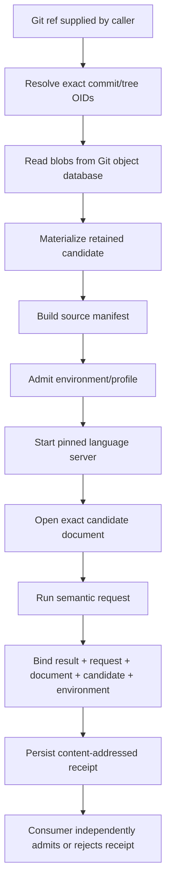

# Architecture

Review-LSP is a standalone candidate-bound semantic execution layer. Its job is to answer semantic code questions about an exact review subject and return evidence that identifies the inputs used to produce the answer.

It is deliberately separate from any specific code-review product.

## Data flow



The live checkout is not an input to the semantic request after the candidate has been prepared.

## Core components

### Candidate preparation

`src/core/candidate.ts`

Responsibilities:

- resolve a Git ref once to exact commit/tree object IDs;
- enumerate paths from Git objects, not the working tree;
- hash admitted file bytes;
- reject unsupported or ambiguous candidate shapes;
- materialize a retained candidate root;
- verify retained bytes before and after semantic execution;
- clean up managed candidate state explicitly.

Important rejected cases include submodules, unresolved Git LFS pointers, escaping or cyclic symlinks, path/case collisions, and candidate mutation.

### Environment admission

`src/core/environment.ts`

The environment manifest binds semantic inputs that can affect language-server behavior, including:

- candidate identity;
- source/config digests;
- semantic profile identity;
- platform/architecture/Node.js;
- isolation mode and isolation identity;
- known limitations.

If a required semantic input is not admitted, the environment remains `PARTIAL`; it is not silently treated as `VERIFIED`.

### Semantic profile

`src/core/profile.ts`

The alpha TypeScript profile pins:

- the Node executable identity;
- `typescript-language-server`;
- `typescript`;
- initialization options;
- document/result resource limits.

Profile identity is content-addressed.

### LSP driver

`src/lsp/client.ts`

The driver owns one language-server subprocess and:

- initializes the server;
- synchronizes candidate documents;
- runs bounded requests;
- enforces advertised capabilities;
- fails pending requests closed when the server exits;
- performs bounded graceful shutdown and process-tree termination.

The driver is transport/execution machinery, not evidence authority by itself.

### Semantic session

`src/core/session.ts`

A semantic session composes candidate + environment + profile + LSP driver.

Before a successful receipt is persisted, the session re-verifies candidate and profile integrity. Definition targets are classified against admitted source/toolchain roots.

### Receipts

`src/core/receipts.ts`

Receipts bind:

- candidate commit/tree/source manifest;
- environment manifest;
- semantic profile;
- session identity;
- operation;
- exact document digest/version;
- request position;
- isolation mode;
- result and result digest;
- limitations.

Receipt IDs are content-addressed. A receipt is tamper-evident but not cryptographically signed.

### Container execution

`src/core/container.ts`

The Linux container profile adds an enforced read-only candidate mount and binds the resolved Docker image identity.

The container runtime uses a read-only root filesystem, no network, dropped capabilities, `no-new-privileges`, bounded process/memory/CPU resources, and tmpfs for writable scratch/state.

The inner process must verify that the candidate root is an explicit read-only Linux mount before it may emit `CONTAINER_READ_ONLY`.

## Public surfaces

### CLI

`src/cli.ts`

The CLI provides the explicit lifecycle:

```text
prepare -> query/inspect -> validate -> close
```

It also exposes MCP serving, artifact identity inspection, and the Linux container query path.

### MCP

The MCP stdio server is bound to one candidate at process start.

Semantic tools require `expected_candidate_id`, preventing a caller from silently retargeting an existing process to a different review subject.

### Consumer adapters

Consumer integrations are outside the standalone core.

For example, the OpenCodeReview/Workbench adapter independently checks candidate/document/environment/provider evidence before admitting a Review-LSP result as exact-candidate review evidence.

This keeps product policy out of the generic semantic core.

## Evidence states

Review-LSP keeps evidence quality explicit:

- `VERIFIED`: all inputs required by the active profile are admitted and verified;
- `PARTIAL`: useful execution is possible, but at least one relevant semantic input is not fully admitted;
- `UNKNOWN`: evidence is unavailable or cannot be established;
- `INVALID`: an integrity or binding check failed.

Consumers should preserve these states. In particular, `PARTIAL` and `UNKNOWN` must never be upgraded to `VERIFIED` merely because a semantic query returned a plausible answer.

## Threat boundaries

### TRUSTED_LOCAL

Protects against accidental/stale candidate confusion and detects retained-candidate mutation at the defined checks.

It does not defend against a malicious host that can modify bytes and restore them between observations.

### CONTAINER_READ_ONLY

Strengthens filesystem/process isolation on Linux and binds the exact container image identity.

It does not defend against a malicious Docker/container host administrator.

### Out of scope

The alpha does not claim:

- semantic correctness of the language server;
- signed/remote-attested receipts;
- dependency snapshot completeness;
- hostile-host protection;
- live-workspace equivalence;
- arbitrary language-server reproducibility.

## Design principles

1. **Exact subject before rich semantics.**
2. **No evidence upgrade by convenience.**
3. **Consumer-neutral core.**
4. **Fail closed at identity/integrity boundaries.**
5. **Keep lifecycle ownership explicit.**
6. **Prefer a narrow verified slice over broad ambiguous support.**

The original architecture decision is documented in [ADR 0001](adr/0001-standalone-candidate-lsp.md).
